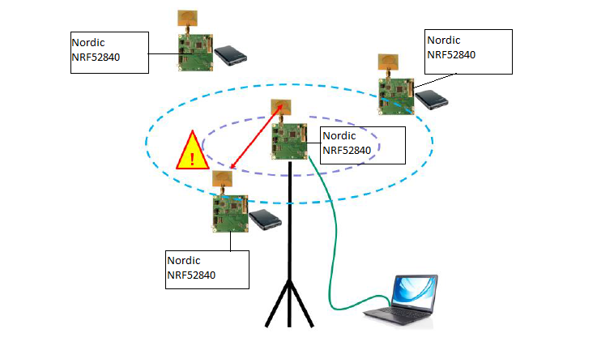
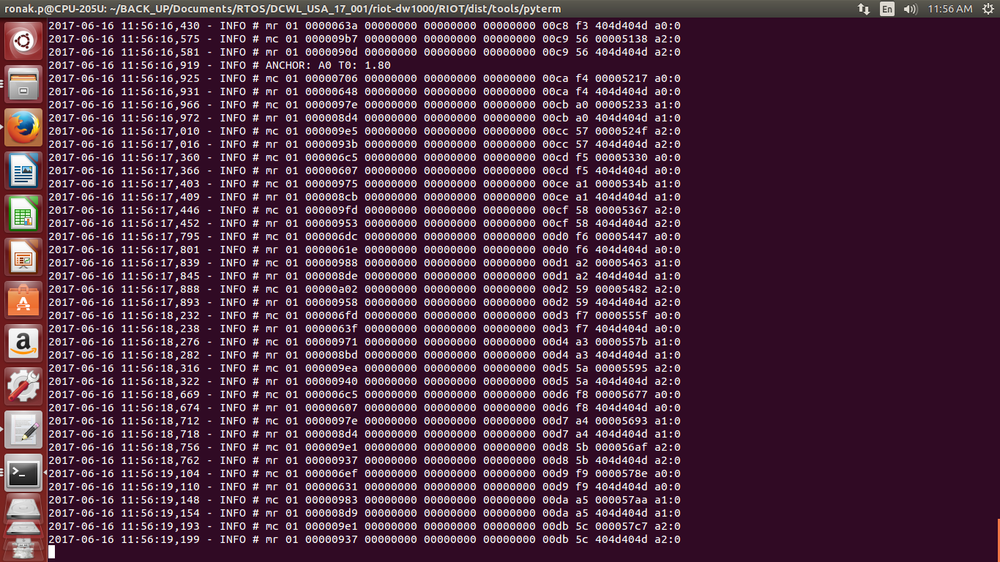

## Geo-Fencing Use-case
* For evaluating the Geo-Fencing use case the system is configured as:
   * 1 Anchor
   * 3 Tags

* Flash the four NRF52840 Nordic platforms with `dw1000_multithreaded_app` application as mentioned in README.md.
* For `dw1000_multithreaded_app` example, the configuration of the Anchor/Tag will be done using user input terminal as shown below.
    * To configure the device as Anchor 0 with Mode 0 :
       ```bash
       Select Mode Configuration:  0:Mode-0 1:Mode-1 2:Mode-2 3:Mode-3
         0
       Select UNIT: 0:TAG 1:ANCHOR
         1
       Enter UNIT ID: 0 t0 2
         0
       ```
    * To configure the device as Tag 0 with Mode 0:
      ```bash
      Select Mode Configuration:  0:Mode-0 1:Mode-1 2:Mode-2 3:Mode-3
      0
      Select UNIT: 0:TAG 1:ANCHOR
      0
      Enter UNIT ID: 0 t0 2
      0
      ```
    * To configure the device as Tag 1 with Mode 0 :
      ```bash
      Select Mode Configuration:  0:Mode-0 1:Mode-1 2:Mode-2 3:Mode-3
      0
      Select UNIT: 0:TAG 1:ANCHOR
      0
      Enter UNIT ID: 0 t0 2
      1
      ```
    * To configure the device as Tag 2 with Mode 0 :
       ```bash
       Select Mode Configuration:  0:Mode-0 1:Mode-1 2:Mode-2 3:Mode-3
       0
       Select UNIT: 0:TAG 1:ANCHOR
       0
       Enter UNIT ID: 0 t0 2
       2
       ```
## Arrangement
* Mount the 3 Tags at the same height
  Note: Differences in heights will result in reduced accuracy of location
* Mount the 3 Tags high enough where there is good Line-of-Sight (LOS) with no
obstructions between them e.g. mounting 2-3 m high would ensure they are above
people’s heads which will help avoid interference.
* Mount the 3 Tags to create a triangle
* Ensure the antennas are >15 cm away from the nearest wall or any other objects
* Connect the PC to the Anchor 0
* open a new terminal for pyterm and input
    * `cd $RIOT_ROOT/dist/tools/pyterm`
    * `sudo ./pyterm -p /dev/ttyACM0`
* Power the other 3 Tags

## Format of ranging results on pyterm - Anchor 0
The application outputs ranging and some debug information on pyterm. Below Figure shows the example output from Anchor 0 as viewed on pyterm.



